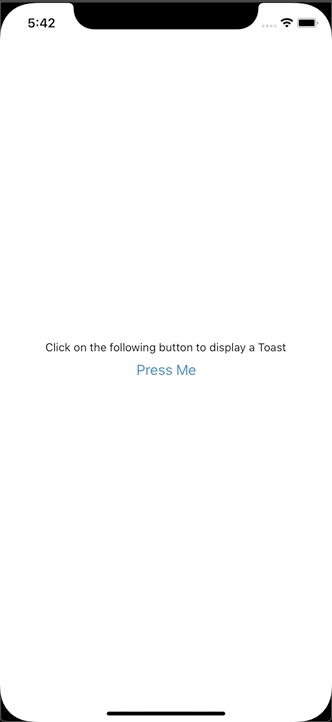

# react-native-root-toaster

A toaster on the top of your React Native App



## Installation

```sh
npm install react-native-root-toaster
```

or

```sh
yarn add react-native-root-toaster
```

## Usage

1. Add the RootToaster component at the root of your application with optionnale default props

```javascript
// ...imports
import { RootToaster, Toast } from 'react-native-root-toaster';

export default function App() {
  return (
    <>
      <YourNavigator />
      <RootToaster defaultMessage={'Default message'} />
    <>
  );
}
```

OR with providers:

```javascript
import { RootToaster, Toast } from 'react-native-root-toaster';

export default function App() {
  return (
    <ThemeProvider>
      <ReduxProvider>
        <YourNavigator />
        <RootToaster defaultMessage={'Default message'} />
      </ReduxProvider>
    </ThemeProvider>
  );
}
```

2. Use the function `Toast.show` anywhere in a your app

```javascript
<Button title="Show a toaster" onPress={() => Toast.show("Hello world!")}>
```

## Available props for RootToaster

| Name            | Type              | Default   | Description                                                          |
| --------------- | ----------------- | --------- | -------------------------------------------------------------------- |
| defaultDuration | number            | 3000      | How long your toaster will be visible                                |
| defaultMessage  | string            | ''        | Default message to show when the toaster is displayed                |
| defaultColor    | string            | '#2e3137' | Default color of the toaster                                         |
| CloseComponent  | FunctionComponent | undefined | Displays a touchable component to close the toaster before the timer |

## Toast.show parameters

```typescript
Toast.show(message: string, duration?: number)
```

# License

MIT
